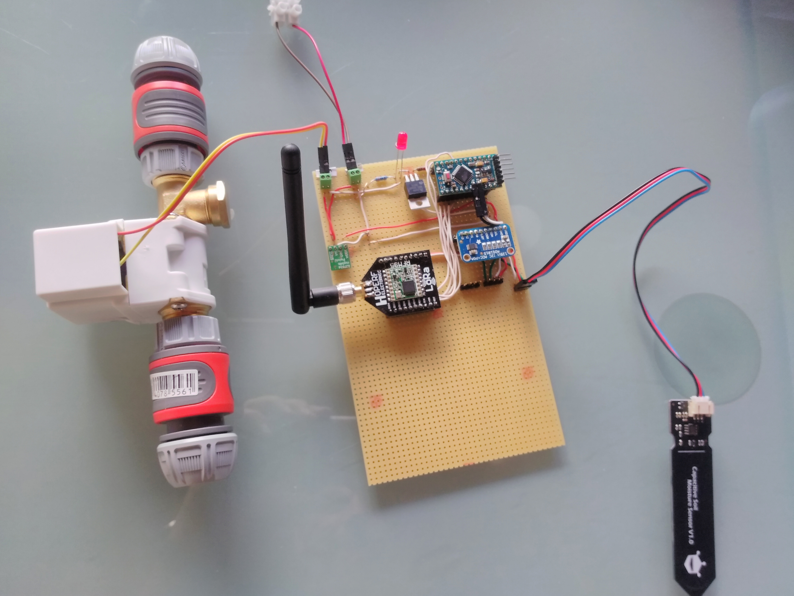

# LoraSmartWatering

Work in progress

## Parts used
- 12V magnetic valve 1/2 inch
- Arduino Pro Mini 3.3v 8Mhz
- MOSFET IRLZ44N
- 1.1k Ohm resistor between MOSFET Gate and Arduino output pin
- 10k Ohm resistor between Arduino digital output and Arduino ground (pull down)
- optional 330 Ohm + LED to indicate (and simulate) open valve
- Adafruit ADS1015 I²C Analog-Digital-Converter (Not necessary but if you want to port to another MCU and/or use more valves you might be happy to have one)
- RFM95 Lora Module - for better wiring on a HopeRF breakout board 
- Pololu 3.3V 600mA Step-Down Voltage regulator (D24V6F3)
- TODO: Status Display

plus an FTDI to program the Arduino, a lot of wires and some stuff from the DIY market for water

## Picture of soldered parts

